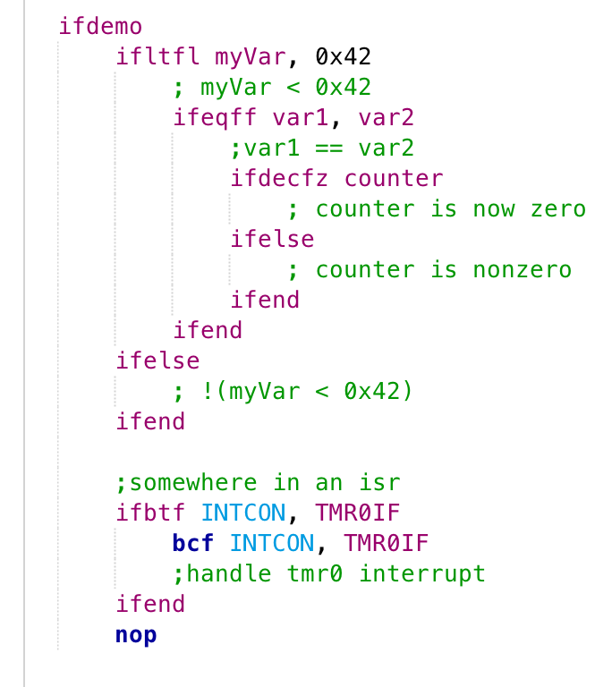
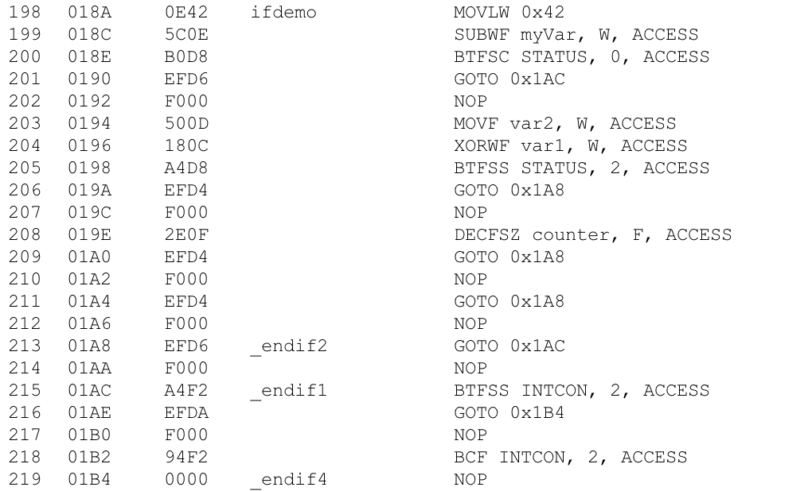

bens PIC macros
=================

Working with PIC assembly can be pretty fun, but sometimes making up names for loop/condition labels and keeping track is just a pain. So I wrote this macro library that lets you write nested IF blocks, just like C or other languages. 

Turns into (the nops are actually the 2nd word of GOTOs)

About
==============

This is a runtime if macro library. It compiles into
real run-time evaluated nested if blocks. I use it for
just about everything and I hope you will too.

I tried to use nomenclature similar to mchips
ie ifzf - check for z in f, not iffz - check f for z

the skipping instructions have an 'if' eqivelent
ie btfss gains an 'if' but loses a 'skip' to become 
ifbtfs or simply ifbtf but remember that:
* btfss skips if true
* 'if' doesnt skip if true

Code legend
==========

| Code  | Description                           |
| ----- | -----------------------------------   |
| if 	|	if stuff							|
| z 	|	zero								|
| c 	|	carry bit							|
| dc 	|	digit carry (carrry for low nibble)	|	
| n 	|	not									|
| f 	|	file register						|
| bt 	|	test that a bit is set				|
| eq 	|	equal								|
| ne 	|	not equal (short form)				|
| gt 	|	greater than						|
| ge 	|	greater than or equal				|
| lt 	|	less than							|
| le 	|	less than or equal					|

